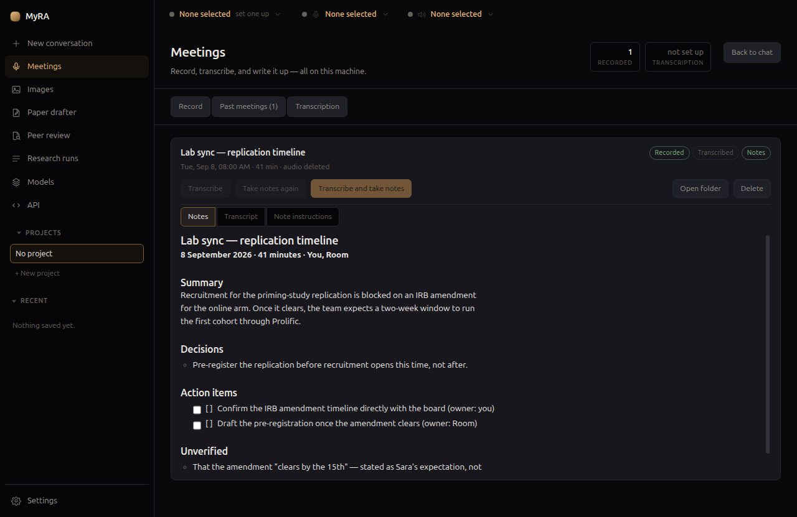

# MyRA

[](https://github.com/noah-schroeder/myra/actions/workflows/ci.yml)
[](../../releases/latest)
[](LICENSE)

TLDR: An all-in-one AI assistant for academic work, intended for non-technical users. Voice to voice, voice dictation, meeting notes, research
synthesis, deep research, document drafting, and AI-assisted reviewing all in one place. Can connect to your Zotero library. You can use private AI models (recommended) or you can configure external models. MyRA is built on Lemonade server, so the app is an all-in-one program that includes llama.cpp, whisper, kokoro, etc. You can download local models directly from HuggingFace within the app.

Note: This app is 100% vibe coded. Don't use it if you're not comfortable with that. 

**[Read the docs](https://noah-schroeder.github.io/myra/)** for a full walkthrough of every
feature, or keep reading for the pitch and the technical detail.

<table>
<tr>
<td width="33%"></td>
<td width="33%"></td>
<td width="33%"></td>
</tr>
</table>

## Contents

- [What it does](#what-it-does)
- [Quick start](#quick-start)
- [Installing it](#installing-it)
- [Running it from source](#running-it-from-source)
- [Configuration](#configuration)
- [What leaves this machine](#what-leaves-this-machine)
- [Architecture](#architecture)
- [Contributing](#contributing)

## What it does

**Meetings.** Records two tracks — your microphone and the system's own output —
which is what separates the speakers without a diarization model. Transcribes
both, merges them, and writes a report where **every claim is checked against the
transcript**. Anything it cannot source is filed under `## Unverified` rather
than stated.

**Research.** Searches OpenAlex and arXiv directly — and PubMed and CORE once you
add your own free key for each — resolves open-access full text through
Semantic Scholar, and can run a full plan → search → read → verify →
synthesise pipeline that produces a cited report.

**Projects.** A folder for one piece of work: put conversations, meetings,
research runs, papers, peer reviews and images in it, and while it is open
everything new files itself there. Delete it and its contents in one action — itemised first,
with the option to keep them. Nothing moves on disk; **Export** writes the whole
project out as one real folder, conversations rendered readable, which is also
what you would send a co-author.

**Paper drafter.** Turns raw, half-formed notes into first-draft academic prose
in **your own voice**: paste a sample of your writing, jot or dictate what you
want to say under each heading, and each section is written on its own. It does
not search and it **never cites** — the prompt forbids references, placeholders
and invented sources outright, and anything citation-shaped that appears anyway
is flagged rather than quietly removed. Work on a whole paper or on one section.

**Documents.** Drafts in Markdown and converts to Word, OpenDocument, HTML or
PDF, jailed to a folder you choose.

**Images.** Makes figures and illustrations from a description, with the model
chosen the same way the speech ones are, and files each into a folder you own
beside a note of what it was asked for.

## Quick start

1. Grab the build for your platform from [Releases](../../releases/latest) and
   install it — see [Installing it](#installing-it) below for the one extra
   click each OS asks for on an unsigned build.
2. On first launch, MyRA checks for **pandoc** (document conversion) and a
   **model runtime** and offers to fetch what's missing — nothing is sent
   anywhere until you say so.
3. Open **Settings → Providers** or **Models** and point MyRA at an endpoint —
   a local one (llama.cpp, Ollama, vLLM) or a hosted API key.
4. Start a conversation, record a meeting, or open the paper drafter. Each
   page explains itself; the [docs](https://noah-schroeder.github.io/myra/)
   go deeper on every one.

## Installing it

Download the build for your platform from
[Releases](../../releases/latest). Every build is **unsigned**, on purpose —
see below — so the first launch takes one extra step:

- **Linux.** The `.deb` installs and runs normally. The `.AppImage` needs no
  package manager or root: `chmod +x MyRA-*.AppImage` and run it.
- **Windows.** SmartScreen says *"Windows protected your PC"*. Click **More
  info**, then **Run anyway**. Once.
- **macOS.** *"Apple could not verify this app is free of malware."*
  **Try to open the app first, then** go to System Settings → Privacy &
  Security, scroll down, and click **Open Anyway**, then **Open**. That order
  matters — the Open Anyway button only appears for about an hour after a
  failed launch attempt, so opening Settings first can find nothing there.

Nobody paid Apple or Microsoft to sign these builds. On Windows that costs a
first-run warning. On macOS it costs the dialog above — a Developer ID would
remove it and fix nothing else, so it is not worth $99/year on its own. Ad-hoc
signing would be free, but a known electron-builder regression makes an
ad-hoc-signed build open the microphone and receive silence, with no error —
the worse failure for an app whose two headline features are dictation and
meeting capture — so these builds skip signing entirely rather than sign
ad-hoc.

## Running it from source

Needs **Node 24** (`node:sqlite`, used for the Zotero fallback path, is
unflagged there) and **poppler** (`pdftotext`, for reading PDFs — `apt install
poppler-utils`, `brew install poppler`, or the Windows build from
[the poppler releases](https://github.com/oschwartz10612/poppler-windows/releases)).

    npm install
    npm run dev

Build a package:

    npm run build      # compile
    npm run deb        # Linux .deb
    npm run dist       # the platform you are on

Tests and typechecks:

    npm test
    npm run typecheck

## Configuration

All of it is in Settings; you should never need to open a JSON file. Point the
endpoints at whatever speaks the OpenAI API — llama.cpp, Ollama, vLLM, or a
hosted provider. API keys go to the OS keyring, never to disk in the clear.

**Speech** is two models rather than an endpoint: one that hears you and one
that speaks, both chosen from a list under Settings → Audio. The list holds
what the bundled runtime can run — Whisper and Moonshine for transcription,
Kokoro for the voice — and anything a provider you added offers. Dictation and
meeting transcription both use the first; the second is what reads answers
aloud in speech-to-speech mode, which is the wave button beside the microphone:
it listens, sends when you pause, answers out loud, and listens again until you
switch it off. Talking over an answer interrupts it.

Document conversion uses **pandoc**, bundled per platform — it is what gives you
CSL citation styles, bibliographies and journal templates. It is not required to
run: without it, documents are written as Markdown and everything else works
normally. PDF output goes through HTML and the app's own browser engine, so
there is no LaTeX toolchain to install.

## What leaves this machine

Stated plainly, because a privacy claim is only honest if its edges are named:

- **Your prompts and audio go to the endpoints you configured.** Point them at
  localhost and nothing leaves. Point them at a hosted API and that traffic goes
  there. The app cannot change that.
- **Speech is the same choice made twice.** A transcription or voice model from
  the bundled runtime stays here; one from a provider you added means your
  recordings, or the answers MyRA reads out, are sent to that provider. The
  picker says which it is, and the model chosen is named on screen.
- **Images go wherever their model is.** A model from the bundled runtime draws
  on this machine and the prompt stays here; one from a provider you added means
  the prompt is sent to that provider. The picker says which, and warns above the
  hosted ones.
- **Drafting a paper** sends the section you asked for — your writing sample,
  your notes and your instructions — to whichever model the bar names, and
  nothing else. A local model means it stays here. The prompt preview shows
  exactly what would be sent, and showing it sends nothing.
- **Scholarly searches** reach OpenAlex and arXiv, which need no key. PubMed and
  CORE are off until you add your own free key for each in Settings → Database
  keys; once added, a search that includes them sends your search terms and
  that key. Semantic Scholar is asked only whether a paper already found has an
  open-access PDF.
- **Pages you ask it to read** see a request from this machine.
- **Looking for a model** reaches Hugging Face, and only when you press
  something: Search sends what you typed, opening a result asks for that
  repository's details and its model card, and Download fetches the files.
  Typing in the box sends nothing. The registry is named, with its country, on
  every result and on every model's page.
- **Downloading a model** also asks Hugging Face for that model's `config.json`
  and `generation_config.json` — two small text files beside the weights — so
  MyRA can size the context window to your machine rather than accept the
  daemon's 4,096, and can start from the sampler settings the model's authors
  published. Same host as the download itself, only when you download, and
  nothing is sent but the repository name. Loading a model afterwards asks
  nothing: what was learned is kept on this machine.
- **Checking for engine updates** asks GitHub which builds of llama.cpp,
  whisper.cpp and the rest have been released, and only when you press the
  button in Settings → Runtime. MyRA never checks on its own, and installing
  one is a separate press.
- Everything else — files, transcripts, meeting audio, conversation history —
  never crosses the network at all.

There is no telemetry, no auto-updater, no crash reporting, and no remote assets:
the content security policy is `default-src 'self'` and the spellchecker is
disabled because Chromium otherwise fetches dictionaries from Google.

## Architecture

One process tree, no daemon, no container, no VM.

```
Electron main                       Renderer (sandboxed)
├─ agent loop  ── the only LLM caller ├─ chat · tool cards · citations
│   └─ tool registry ~8 tools         ├─ meeting capture (getUserMedia)
├─ core/       pure TS, no electron   └─ settings
│   ├─ audio      speech · voices · what is worth reading aloud
│   ├─ images     prompts · sizes · where a picture is filed
│   ├─ library    Zotero: local API, then the database file
│   ├─ meetings   merge · prompts · verify
│   ├─ research   OpenAlex · arXiv · PubMed · CORE · S2 · hydrate · pdf
│   ├─ documents  pandoc argv · path jail
│   └─ llm        one HTTP client, OpenAI-shaped
└─ pandoc      fetched into your data directory on first use, not bundled
```

**The tool registry is the security boundary.** There is no `bash`, so "run a
command" is not something the protocol can express — the model can only emit a
call matching a schema in [registry.ts](src/core/agent/registry.ts), and that
list is the complete set of things the agent can do.

Two rules hold that boundary up, and neither may be relaxed:

1. **Tools build their own argv from a fixed template.** pandoc's `--lua-filter`
   executes arbitrary code, so a passthrough argument would be a shell with
   extra steps.
2. **Every path is resolved and jailed on every call**, with `realpath`, after
   normalisation — so a symlink pointing out of the jail is caught.

See [PLAN.md](PLAN.md) for the build plan and threat model, [PORT.md](PORT.md)
for what came across from the VM-based v1, and [DECISIONS.md](DECISIONS.md) for
the judgment calls that are still open.

## Contributing

Bug reports and pull requests are welcome — see
[CONTRIBUTING.md](CONTRIBUTING.md) for how to build, test, and where the
design docs above fit in.
