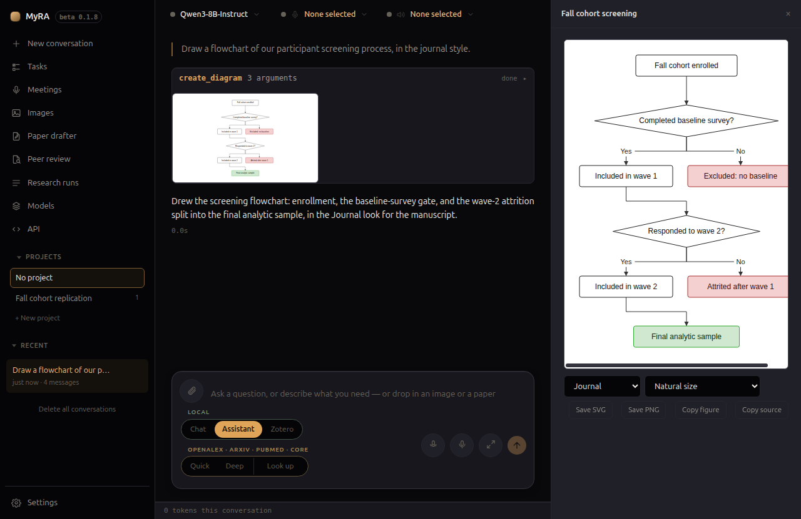

# Figures & diagrams

Ask MyRA to draw a flowchart, a PRISMA 2020 diagram, a chart, or a table, and
it opens in a panel beside the conversation — the same panel a drafted
document uses, so you read the figure against the exchange that produced it
rather than losing either one to a modal. The panel keeps a tab for
everything a conversation has produced, in the order each was first made, for
as long as that conversation exists — reopening an old chat brings its past
figures back with it. In the thread itself, a diagram also gets a small
clickable thumbnail right under the tool call that drew it.

## Diagrams

A flowchart is written by the model in Mermaid syntax, but never handed to a
renderer that executes it — MyRA reads the flowchart subset itself, lays it
out, and draws it as an SVG. What's on screen is always exactly what was
drawn; nothing here can turn into arbitrary HTML or script. Only flowcharts
are supported; asking for a sequence diagram or one with subgraphs gets a
named refusal the model is expected to work around, not a half-drawn figure.

Pick a **look** from the Style menu on the figure itself:

- **Standard** — matches the app's own theme on screen, plain and light on
  export.
- **Journal** — Helvetica/Arial, thin rules, a colour-blind-safe palette, no
  shadows.
- **Poster** — semibold text, roomy spacing, rounded boxes, heavier arrows.
- **Monochrome** — Journal's layout in greys.

A colour the model set explicitly (asked for "make the screening steps
green") always wins over the look's own palette. The model can suggest a look
when you ask for one, but the Style menu on the figure always has the final
say, and it's remembered as the default for the next diagram you draw without
naming one — so a run of figures for one poster comes out consistent without
re-picking it each time.

## PRISMA 2020 diagrams

Ask for a PRISMA flow diagram and MyRA asks two questions first, as plain
choice dialogs:

1. *"Is this a new systematic review, or an update of an earlier one?"*
2. *"Besides databases and registers, did this review search other sources —
   websites, organisations, or citation searching?"*

Together these settle which of the four official 2020 templates applies.
MyRA then shows a form — **"PRISMA flow diagram — fill in or check every
number"** — grouped by phase (Identification, Screening, Included), with the
exact fields that template calls for, plus free-text lists for the databases
searched and the reasons reports were excluded. Anything the model already
read out of the conversation is prefilled and marked **"From what you
said — check it"**, never drawn straight onto the figure — this is the
figure an editor checks a review against, so a hallucinated number sitting in
a filled-in field is exactly the failure to avoid. A field you leave blank is
simply left off the figure; MyRA never draws a box reading "n = 0" for
something nobody actually measured.

A PRISMA figure has no Style menu — it always renders in the official
template's own black-and-white look — and its **Copy source** button is
replaced by **Edit numbers**, which reopens the same form, prefilled with
what's already on screen, and redraws the figure in place.

Running a [deep research](research.html) review offers its own **PRISMA
diagram** button on the run's page, which draws a figure straight from that
run's real, measured counts with no chat involved. It too gets **Edit
numbers**, for the handful of counts a run can't measure itself — registers,
automation-tool exclusions, full texts sought but not retrieved, and reasons
for excluding a report one by one.

## Charts and tables

`create_chart` draws a **scatter**, **line**, **bar** (optionally stacked),
**box**, or **histogram** chart from data pasted or dropped into the
conversation — never from numbers the model just typed. A scatter can group
points into series, and can add a trend line MyRA itself computes rather than
the model. Unlike a diagram, whose labels are its entire content and so
scroll rather than shrink, a chart **redraws to fit** the panel as you resize
it, since its axes and marks are recomputed from the data at any size.

`create_table` draws a formatted table from the same kind of pasted data,
optionally choosing and reordering a subset of columns. A cell that isn't a
plain number — `12.3*`, `<0.001` — is flagged rather than silently treated as
one; MyRA would rather show you an odd cell than guess its value.

## Exporting

A diagram or PRISMA figure offers **Save SVG**, **Save PNG**, **Copy
figure** (a PNG to the clipboard), and **Copy source** (the raw Mermaid text)
or, on a PRISMA figure, **Edit numbers** in its place. A chart adds **Copy
PGFPlots** and **Save .tex**, for a manuscript that compiles its own figures
in LaTeX. A table offers **Copy for Word**, **Copy LaTeX**, **Copy
Markdown**, and **Save .tex** instead — there's no image to export, only
text in different shapes.

Nothing is written to disk until you use one of these. For a diagram, PRISMA
figure, or chart, export size is a separate, explicit choice from what fits
the panel on screen: the figure's own natural size, a portrait page, or a
landscape page (sized to A4 or Letter by your system's own locale) —
remembered per figure kind, so a run of figures for one paper comes out at
one size each without re-picking it every time.
