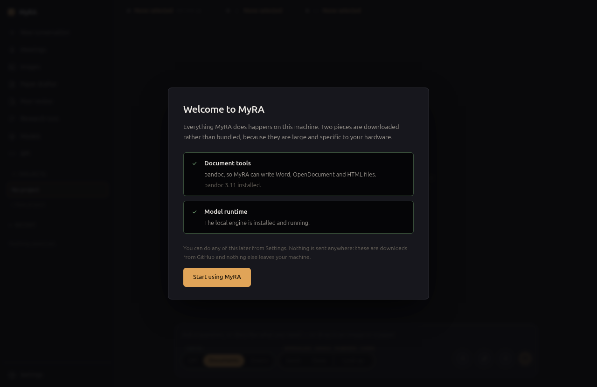

# First run

## The welcome screen

The first time MyRA opens, it checks for two things it needs but doesn't
bundle, because they're large and specific to your hardware:

- **Document tools** — pandoc, so MyRA can write Word, OpenDocument and HTML
  files.
- **Model runtime** — the local engine that runs models on this machine.

Both downloads come from GitHub, and nothing else leaves your machine at
this step. You can skip either one and set it up later from Settings —
MyRA still works without pandoc (it writes Markdown instead) and without a
local runtime (point it at a hosted provider instead).

## The guided tour

After the welcome screen, MyRA offers a short, thirteen-stop tour of where
things live. It's entirely optional — click **Skip** at any point — and you
can't break anything by clicking through it, since it doesn't create real
data.

## Pointing MyRA at a model

Nothing works until MyRA has somewhere to send a conversation. Open
**Settings → Providers** and either:

- **Add a local endpoint** — anything that speaks the OpenAI API: llama.cpp,
  Ollama, vLLM. If you installed the bundled model runtime in the welcome
  step, this is mostly done for you.
- **Add a hosted provider** — paste in a base URL and an API key. Keys are
  stored in your OS keyring, never on disk in the clear.

See [Providers & models](providers-and-models.html) for the full picture,
including how MyRA sizes a model to your hardware.

## Next

Once a model is configured, jump to whichever feature page matches what
you're trying to do — [Meetings](meetings.html), [Research](research.html),
[Paper drafter](paper-drafter.html), and the rest are listed on the
[home page](index.html).
