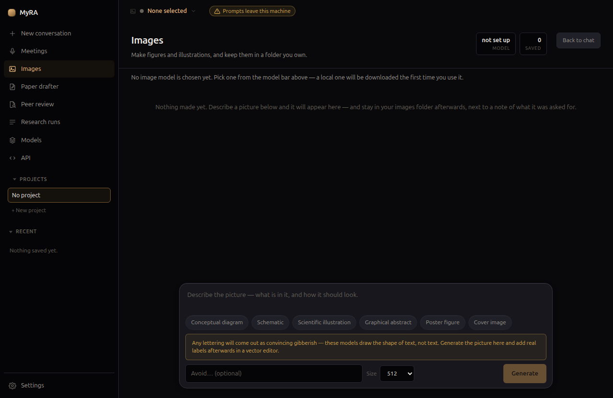

# Images

MyRA makes figures and illustrations from a description, and keeps them in
a folder you own.

## Making one

Describe the picture, optionally pick a shortcut (conceptual diagram,
schematic, scientific illustration, graphical abstract, poster figure, cover
image) to steer the style, and generate. One image generates at a time,
deliberately — running two image passes at once is the same out-of-memory
risk that meeting transcription avoids by working through audio serially.

**Any lettering in a generated image will come out as convincing-looking
gibberish** — these models draw the shape of text, not the text itself.
Generate the image here, then add real labels afterward in a vector editor.

## Where they're filed

Every image is saved into your images folder (set in **Settings →
Folders**) beside a small note of what it was asked for — so a folder of
generated figures stays legible months later, not just a pile of PNGs.

## Model choice, and what leaves this machine

Pick the image model from the model bar, the same way you'd pick a speech
model. A model from the bundled local runtime draws on this machine and the
prompt never leaves it; a model from a provider you've added sends the
prompt to that provider. The picker says which is which, and warns above
any hosted option.
