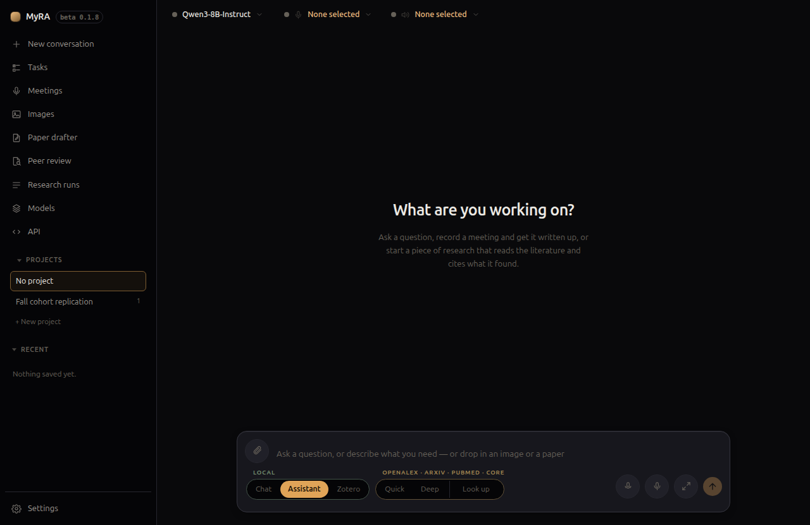

# MyRA

A private, local-first assistant for academic work: meeting notes, research
synthesis, and document drafting. Everything runs on your own machine, and
the only things that leave it are the requests you configure it to make.

This site covers every feature in the app. If you just want to install it
and go, start with [Installing MyRA](installing.html); if you want the
five-minute tour, the app has one built in on first launch.

## What's here

- **[Installing MyRA](installing.html)** and **[First run](first-run.html)** —
  getting it onto your machine and through the one-time setup.
- **[Providers & models](providers-and-models.html)** — pointing MyRA at a
  local runtime or a hosted API, and picking models.
- One page per feature: **[Projects](projects.html)**,
  **[Your library](library.html)**, **[Meetings](meetings.html)**,
  **[Research](research.html)**, **[Paper drafter](paper-drafter.html)**,
  **[Peer review](peer-review.html)**, **[Figures & diagrams](figures.html)**,
  **[Documents](documents.html)**, **[Tasks](tasks.html)**,
  **[Images](images.html)**, and **[Speech & dictation](speech.html)**.
- **[Privacy: what leaves this machine](privacy.html)** — a plain accounting
  of every network request MyRA makes and when.
- **[Architecture](architecture.html)** — for anyone reading the code or
  reviewing the security model.
- **[Threat model: what contains the agent](threat-model.html)** — what the
  agent can and cannot reach, stated with its limits rather than only its
  guarantees.
- **[Troubleshooting](troubleshooting.html)** — the setup problems people
  actually hit.

## Elsewhere

- [Source and releases on GitHub](https://github.com/noah-schroeder/myra)
- [CONTRIBUTING.md](https://github.com/noah-schroeder/myra/blob/main/CONTRIBUTING.md)
  for building from source and the code conventions
