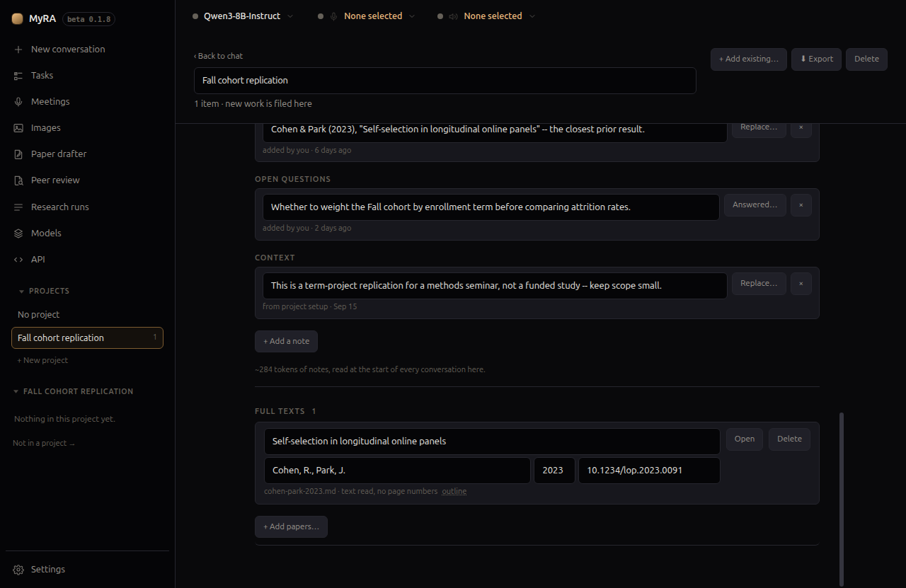

# Your library

The papers you've already collected and decided matter — searchable from
inside a conversation, read section by section, with no vector database and
nothing leaving this machine.

## Zotero

If Zotero is installed, MyRA can search it directly: through Zotero's own
local API when it's running, or its database file otherwise, so it works
whether or not Zotero itself is open. Nothing is ever written back to
Zotero.

**Outside a project**, turning the mode bar to **Zotero** searches your whole
library. **Inside a research project**, link the collections that project is
actually built on from the project's own page:

Click **+ Link a collection**, pick one from the tree, and its subtree comes
with it. Linking isn't filing — the papers stay in Zotero, MyRA never writes
there, and one collection can be linked to any number of projects. Each
linked collection shows as a chip carrying its live name from Zotero, a note
of how many child collections came with it ("+ N below"), or "— no longer in
Zotero" if it's since been deleted there; unlink one with the **×** beside
it, which changes nothing in Zotero itself. A status line under the chips
says how many of the linked papers have a PDF MyRA can actually read — the
rest are still searched, by their abstracts alone.

Once linked, the project's conversations search that union — titles,
abstracts, tags, notes, and the indexed text of attached PDFs — instead of
your whole library, and can open and read the PDFs themselves, one section
at a time, citing the page. A linked (rather than Zotero-managed) PDF file —
from ZotMoov, Attanger, or a synced attachments folder — is read too, at
exactly the path Zotero's own database records for it.

## Papers you upload

Drop PDFs, Word, or Markdown files onto a project's page under **Full
texts**, or click **+ Add papers…** for an ordinary file picker instead:

> Drop the papers this project is built on here — PDFs, or Word and Markdown
> files. In this project's conversations MyRA can then search their full
> text and read them section by section, citing the page. They stay on this
> machine.

MyRA guesses a title and DOI from the first few pages — both editable
inline, along with authors and year, and nothing is looked up online. Each
row shows its original filename and whether the text could be read: a page
count when it could, or a note that it looks like a scan with no OCR layer
when it couldn't — still kept and still shown, never silently dropped.
**Delete** asks once more before it acts, because it's a real delete: an
uploaded paper exists only for this project, so removing it removes the file
too, not just its place in the list.

## How the model uses it

The model doesn't get a nearest-neighbour lookup — it navigates the way you
would: a list of what's available, a keyword search that points at specific
passages, then the section actually worth reading. Every result comes back
as literal text with its page number, which is what makes it quotable and
checkable — the one thing a citation can't settle for is "similar to," which
is all a vector search could offer instead.

This is a different question from [Research](research.html)'s **Quick** and
**Deep** modes, which search the open literature you haven't already
collected — the two are meant to be used together, not as alternatives.
