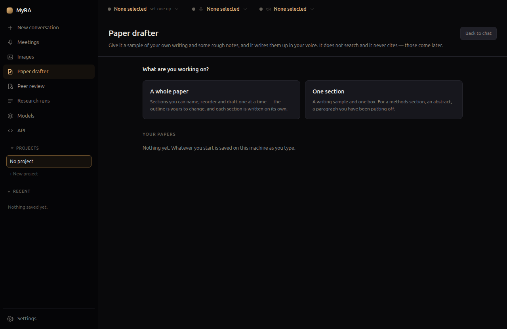

# Paper drafter

The paper drafter turns raw, half-formed notes into first-draft academic
prose in **your own voice** — not a generic model voice.

## How it works

1. Paste a sample of your own writing.
2. Under each heading, jot or dictate what you want that section to say —
   notes, not prose.
3. Each section is drafted on its own, using your sample to match voice.

Work on **a whole paper** — sections you name, reorder, and draft one at a
time, with the outline entirely yours to change — or **one section**, for a
methods paragraph or an abstract you've been putting off.

## What it deliberately does not do

The paper drafter **does not search, and it never cites.** The prompt
forbids references, placeholders, and invented sources outright — and if
anything citation-shaped shows up anyway, it's flagged rather than quietly
removed. Citations come from [Research](research.html) or your own editing
afterward; mixing that job into drafting is exactly how a model ends up
inventing a source that sounds plausible.

## Starting from a project's notes

Drafting inside a [research project](projects.html#research-project-notes)
with notes of its own adds a **+ From project notes** button, which copies
your settled questions, aims, theory, methods, and decisions — never key
literature, since the drafter forbids citations — straight into the
instructions box, where the preview shows exactly what went in.

## What's sent, and when

Drafting a section sends the section you asked for — your writing sample,
your notes, and your instructions — to whichever model you've chosen, and
nothing else. A local model means it never leaves this machine. The prompt
preview shows exactly what would be sent before you send it, and showing the
preview sends nothing itself.

Everything you write is saved on this machine as you type.
