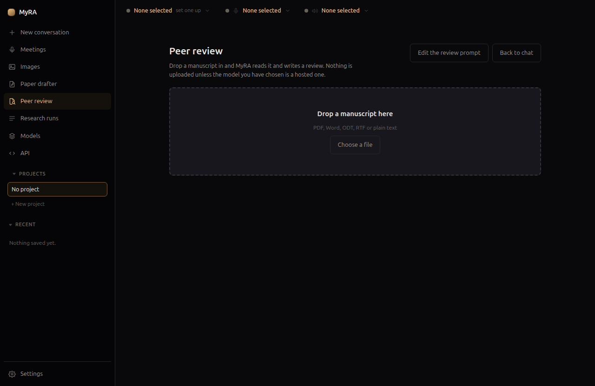

# Peer review

Drop in a manuscript you've been asked to review, and MyRA writes a panel's
worth of reports on it.

## The panel

Three reviewers, each asked separately rather than in one combined request —
which is closer to how a journal actually works, and keeps each request
small. Their prompts share most of their text (house rules against
inventing literature, reporting citations rather than repairing them) but
differ in what each one is actually looking for — a statistician's read on
an experiment, a PRISMA 2020 checklist on a systematic review, and so on
depending on the study design.

A reviewer that returns nothing has its failure filed under its own
heading rather than silently dropped — if two of three reviewers respond,
you keep those two.

## Editable prompts

Unlike the paper drafter, these prompts are **editable** — a reviewer's
standards are their own, and journals differ. The rule against inventing
literature is stated in the prompt text itself, where you can read it,
rather than hidden somewhere it can't be changed. Click **Edit the review
prompt** to see and change it.

## What happens to the manuscript

**The manuscript is never written to disk.** It's read directly as bytes
when you drop it in, held in memory for the length of the review, and
discarded afterward — it's somebody else's unpublished work, and MyRA never
even learns the file's original path on your machine. Only the finished
review is kept.

If a manuscript is too long for the model you've chosen, MyRA refuses
rather than silently truncating it — a review that quietly stops partway
through the major concerns is worse than one that says up front it can't be
done with the current model.
