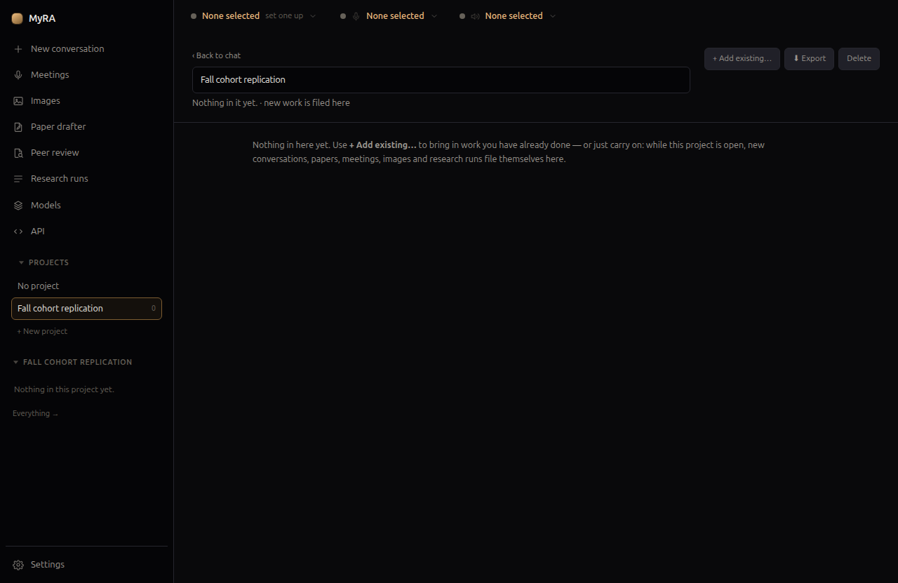

# Projects

A project is a folder for one piece of work. Open it, and everything new you
create — conversations, meetings, research runs, papers, peer reviews,
images — files itself there automatically.

## Creating and opening one

Click **+ New project** in the left rail. MyRA creates it and switches into
it immediately — opening and working in a project is deliberately one
action, not two, so the automatic filing never fires for a project you
don't think you're in.

Rename it any time from its own page, at the top.

## What lives inside

Nothing about a project changes where files sit on disk beyond normal
filing — MyRA doesn't move things around behind your back. Use
**+ Add existing…** to bring in work you did before the project existed.

## Exporting

**Export** writes the whole project out as one real folder — conversations
rendered readable, not raw JSON — which is exactly what you'd hand to a
co-author.

## Deleting

Deleting a project itemises its contents first, with the option to keep
them rather than delete everything along with the project shell.
