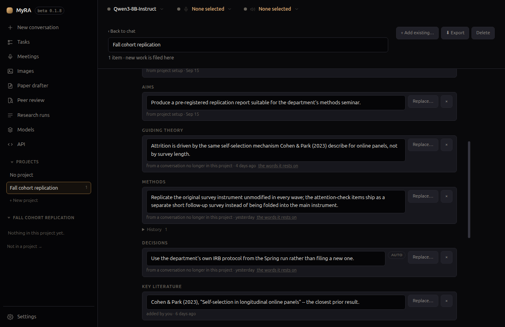

# Projects

A project is a folder for one piece of work. Open it, and everything new you
create — conversations, meetings, research runs, papers, peer reviews,
images — files itself there automatically.

## Creating and opening one

Click **+ New project** in the left rail. You're asked which kind:

- **Simple folder** — just a place to group work. Nothing else happens.
- **Research project** — opens a short chat about what you're studying, and
  keeps what comes out of it as notes every later conversation in this
  project can read (see [Research project notes](#research-project-notes)
  below). A simple folder can still start that same chat later, from
  **Start research setup** on its own page — the choice here is a default,
  not a fork in what a project can become.

Either way MyRA creates the project and switches into it immediately —
opening and working in a project is deliberately one action, not two, so the
automatic filing never fires for a project you don't think you're in.

Rename it any time from its own page, at the top.

## What lives inside

Nothing about a project changes where files sit on disk beyond normal
filing — MyRA doesn't move things around behind your back. Use
**+ Add existing…** to bring in work you did before the project existed.

## Research project notes

A research project keeps notes under eight headings: **Research questions**,
**Aims**, **Guiding theory**, **Methods**, **Decisions**, **Key literature**,
**Open questions**, and **Context**. Every conversation filed to the project
reads them, so the second conversation about a project doesn't start by
re-explaining the first.

**The setup chat.** Creating a research project (or clicking **Start research
setup** on a simple folder) opens with a fixed greeting rather than a blank
box: *"This is a research project. Tell me about it — what you're studying,
why it matters, and anything you already know about how you want to approach
it."* Describe it in your own words, and MyRA shows what it noticed as
candidate notes for you to edit or clear — nothing is saved un-reviewed —
then offers a handful of concrete next steps (brainstorming research
questions, suggesting guiding theories, sharpening the scope, thinking
through methods, noting key literature), asks a few short questions about
whichever you pick, and shows what came out of that for review too.

**Decisions are picked up as you talk**, in any conversation in the project,
not just the setup chat. Say "let's go with X" and MyRA saves it as a note on
that same turn — a notice under your message names what was kept. A checkbox
on the project page, **Keep this up to date automatically**, turns this off;
turning it off leaves the two manual routes below untouched. Nothing is ever
saved without being grounded in something you actually typed, or your own
reply agreeing to something MyRA proposed.

**Nothing written by a person is ever silently changed.** A note MyRA saved
on its own is closed the moment a new one clearly replaces it. A note you (or
the setup chat) wrote is never touched automatically — instead the project
page asks you, beside the note: **Replace…** (or **Answered…**, for an open
question) or **Keep both**. A closed note isn't deleted; it drops into a
**History** you can expand under its heading, with a **Restore** button if
you change your mind again.

**Where you left off**, on the project's own page, is built from these
records with no model involved: notes added since your last visit, notes
that were replaced or answered, new work filed in, open questions still
open, and — when an automatic note is proposing to replace or answer
something a person wrote — a line telling you suggestions are waiting under
Notes.

**Two more ways to add a note by hand.** Highlighting any text in a reply
shows a small **Remember** button right beside the highlight; every message
also has one beside its Copy button, for keeping the whole thing (it flips to
**Noted** once saved). Either opens a dialog — *"Remember this in
"\<project name\>""* — with a slot to file it under and the text itself,
editable, so you can trim a whole reply down to the one sentence worth
keeping. Separately, **Update project notes from this chat**, in the chat
page's status bar, re-runs the same extraction over the whole conversation on
demand (it reads **Checking this chat…** while it works) and shows everything
it found for review before saving anything — unlike the automatic pass, which
only ever saves wording already grounded in something you or a confirmed
reply actually said.

**Every note says where it came from** — the quote it was grounded on, and
the conversation or meeting it happened in, which the note opens directly at
that point. A decision that changes is replaced, not overwritten, and
**Export** writes the whole history as a dated `decision-log.md` — how a
decision changed is exactly what a methods chapter, or a reviewer, asks
about.

**Meetings can contribute too.** A meeting filed to a research project offers
**Add to project notes…**, which shows the decisions, questions and risks the
transcript actually supports for you to review before anything is saved.

Notes are never capped for size on disk. Past a quarter of your model's
context window the project page warns you; past half, older fields are left
out of what's sent to the model, in priority order — questions and aims
survive longest.

## Your library

A research project can link **Zotero collections** and hold **uploaded
papers**, both searchable full-text from inside its conversations. See
[Your library](library.html) for how to add either.

## Where filed work shows up

Once something is in a project, it leaves the **Recent** list in the rail and
appears on the project's own page instead. The rail shows one group at a time:
the project you are in, or — through the button under the list — the work that
is in no project at all.

That is also what makes **Delete all conversations** safe to press. It clears
the loose conversations the list is showing and never reaches into a project,
so filing something is a way of keeping it.

## Exporting

**Export** writes the whole project out as one real folder — conversations
rendered readable, not raw JSON — which is exactly what you'd hand to a
co-author.

## Deleting

Deleting a project itemises its contents first, with the option to keep
them rather than delete everything along with the project shell.
