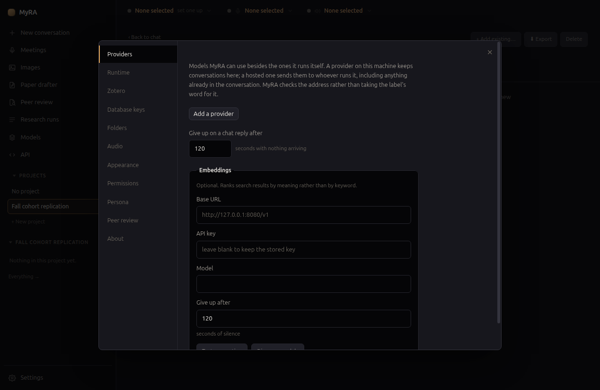
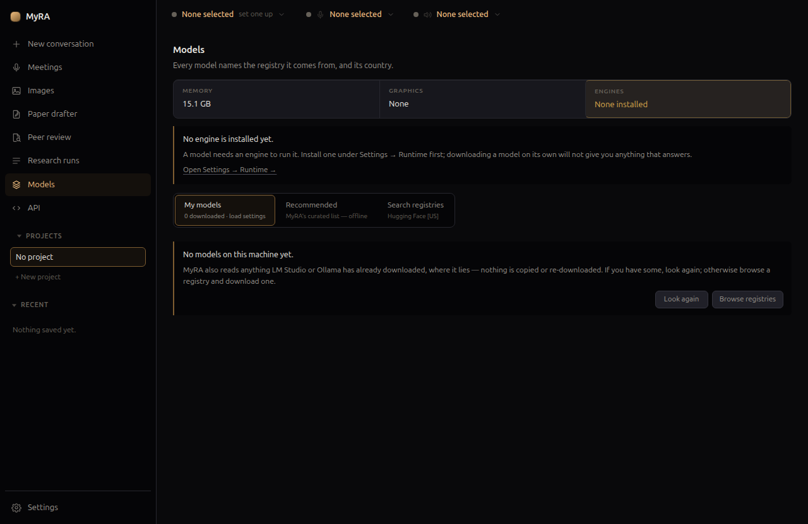
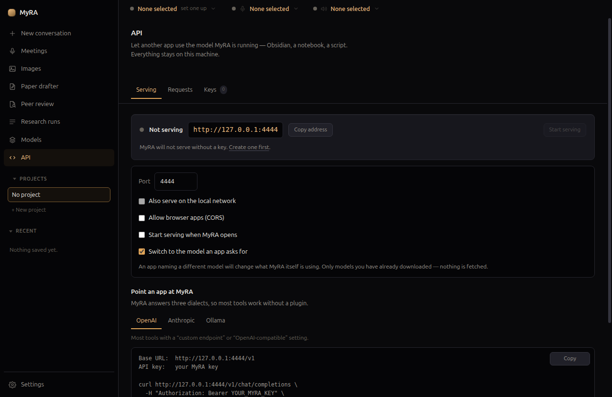

# Providers & models

Everything configurable in MyRA lives in Settings — you should never need to
open a JSON file.

## Providers: where the chat model lives

**Settings → Providers** is where you point MyRA's conversation at an
endpoint. Add as many as you like:

- **A local endpoint** — anything that speaks the OpenAI API: llama.cpp,
  Ollama, vLLM, or MyRA's own bundled runtime.
- **A hosted provider** — a base URL and an API key. Keys go to your OS
  keyring, never to disk in the clear.

A provider's `local`/`external` label can only make MyRA **more** cautious:
an endpoint that isn't actually on this machine is treated as external no
matter what it's labelled.

This pane also configures **embeddings** — optional, and used only to rank
search results by meaning instead of keyword — and how long MyRA waits for a
reply before giving up.

## The bundled runtime

MyRA can run models itself, via a local runtime called **Lemonade**, managed
under **Settings → Runtime**. It downloads engines per model family
(`llama.cpp` for chat, `whisper.cpp` for transcription, `kokoro` for voice,
`stable-diffusion.cpp` for images) and MyRA supervises them directly — nothing
it starts outlives the app, and it never advertises itself on the network.

## The Models page

**Models** in the left rail shows what your machine can run, and what's on
it already:

- **My models** — what's downloaded, with load settings per model.
- **Recommended** — MyRA's own curated list, available offline.
- **Search registries** — currently Hugging Face. Typing in the search box
  sends nothing; pressing Search sends what you typed, and every result is
  labelled with the registry and country it came from.

MyRA also reads models you've already downloaded with LM Studio or Ollama —
nothing is copied or re-downloaded.

Downloads are anonymous by default. Some publishers gate a repository behind
an accepted licence; for one of those, paste a Hugging Face access token into
**Settings → Runtime** — MyRA restarts the model server once to carry it, only
for that download, unless you choose to send it with every download instead.

### Sizing a model to your hardware

Loading a model with no guidance defaults to a 4,096-token context window,
whatever the model can actually do. MyRA replaces that default by computing
a context size that:

- Leaves a real buffer against graphics and system memory together, not
  just VRAM — the KV cache alone can be several gigabytes beyond the file
  size, and a context that "fits on paper" still shares the machine with
  everything else running on it.
- Never exceeds the model's own trained length or the ceiling the runtime
  reports for it.
- Is never silently written down when it doesn't fit — a context that won't
  fit is left unset rather than loaded and left to fail.

A model you loaded and pinned settings for yourself is never overridden.

### Sampling defaults from the model's own authors

When you download a model, MyRA also fetches its `config.json` and
`generation_config.json` from Hugging Face — two small text files, not the
weights — so sampling defaults (temperature, top-p, and the rest) start from
what the model's authors published, with anything you set yourself applied
on top, per field. Loading a model afterwards asks the network nothing.

## The local API

**API** in the left rail lets another app on your machine use the model
MyRA is running — Obsidian, a notebook, a script — through an OpenAI,
Anthropic, or Ollama-shaped endpoint.

It's off by default, refuses to start without a key, and only listens on
loopback unless you explicitly turn on **Also serve on the local network**.
