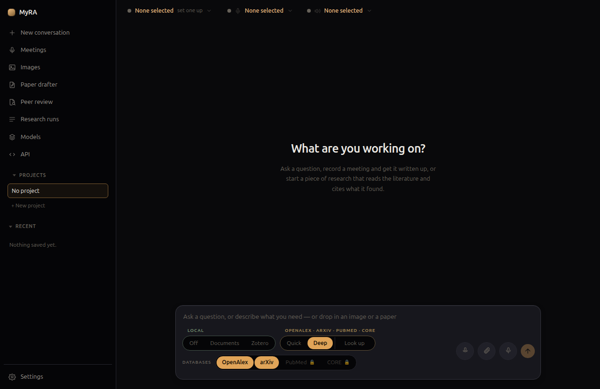
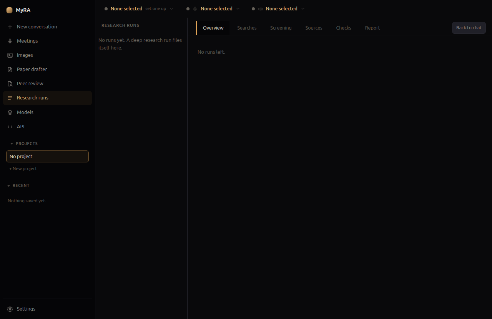

# Research

Research has its own ladder of modes, from a plain chat with no search at
all up to a full literature-review pipeline. Pick one from the bar under the
message box:

- **Off** — no search, just the model.
- **Documents** — search what's in the current project.
- **Zotero** — search your Zotero library (see below).
- **Quick** — a handful of searches against the databases you've enabled,
  read and answered directly in the conversation.
- **Deep** — the full pipeline: scope, plan, discover, screen, snowball,
  retrieve, extract, synthesize, verify, review, revise. Produces a cited
  report, not just an answer.
- **Look up** — resolve a specific reference rather than run a search.

Quick and Deep are exclusive, not cumulative — Deep doesn't do what Quick
does plus more, it's a genuinely different, slower process.

## Databases

Scholarly search goes straight to the source APIs, not a general web search
tool:

- **OpenAlex** and **arXiv** need no key and are on by default.
- **PubMed** and **CORE** need your own free key each, added in
  **Settings → Database keys**. A search that includes them sends your
  search terms and that key.
- **Semantic Scholar** is asked only whether a paper already found has an
  open-access PDF — it's never a search target itself.

## Deep research runs

A deep research run happens in stages, each one written to disk before the
next starts — so a run can be resumed, and a long one surviving a restart
doesn't have to redo work it already finished.

Everything the pipeline asks you happens in its first two stages — scoping
the question and approving the plan. After that, a run is meant to be
started and left alone; it won't stop partway through to ask something new.

Track a run's progress, or read a finished one, from **Research runs** in
the left rail — each tab (Searches, Screening, Sources, Checks, Report)
is one stage's own output.

## The Zotero library

If you use Zotero, MyRA can search your library directly — through Zotero's
local API when it's running, or its database file otherwise — so your own
collection is part of what deep research and Quick search draw on, alongside
the open databases above.
