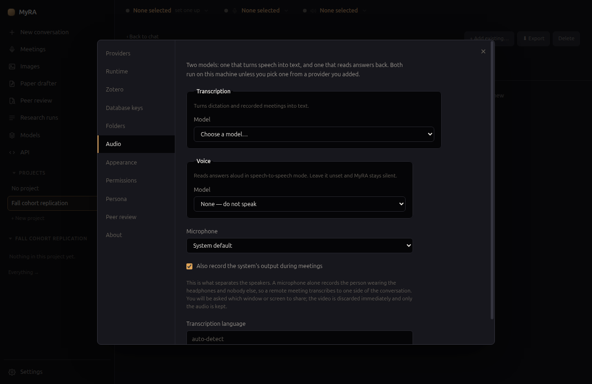

# Speech & dictation

Speech in MyRA is **two models, not an endpoint** — one that hears you, one
that speaks — both chosen from a list under **Settings → Audio**.

## Transcription

The list holds what the bundled runtime can run (Whisper and Moonshine) plus
anything a provider you've added offers. This one model is used for both
**dictation** — typing by voice, anywhere there's a text field — and
**meeting transcription**.

## Voice

The second model is what reads answers aloud in **speech-to-speech mode**,
the wave button beside the microphone: it listens, sends when you pause,
answers out loud, and listens again until you switch it off. Talking over
an answer interrupts it. Leave the voice model unset and MyRA stays silent —
speech-to-speech mode just isn't available until you pick one.

## Keyboard shortcuts

Both the microphone and the speech-to-speech button can be given a shortcut
in **Settings → Audio**: click the shortcut field, then press the keys you
want. Dictation offers a choice of two behaviours — **Toggle** starts and
stops recording on the same key press, and **Hold to talk** records only
while the keys are held down, stopping the moment you release them (or click
away from MyRA). Speech-to-speech is a toggle only: it starts an ongoing
listen-answer-listen loop rather than a single recording, so there's nothing
for a hold to bound.

Neither shortcut is set by default, and neither works outside the MyRA
window. Electron has no reliable way to register a key combination with the
desktop on Linux, so rather than a shortcut that works on some desktops and
silently does nothing on others, these only ever fire while MyRA has focus.

## What leaves this machine

Speech is the same local/hosted choice made twice, once per model. A
transcription or voice model from the bundled runtime stays on this
machine. One from a provider you've added means your recordings, or the
text MyRA reads out loud, are sent to that provider — the picker always
says which kind of model you're choosing, and names the model on screen
while it's in use.
