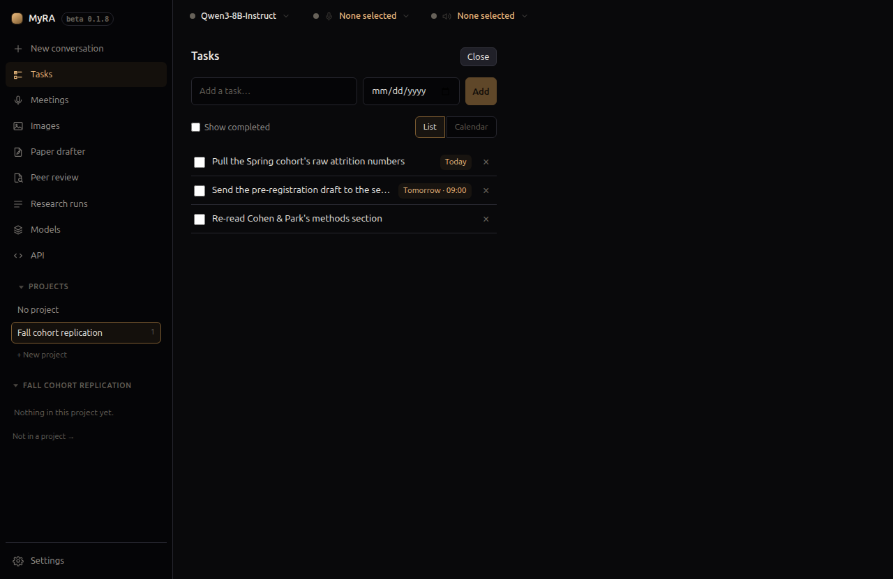

# Tasks

MyRA's own task list — not your calendar, not any other program, and
nothing written here appears anywhere else.

## Adding one

Most tasks here aren't expected to be typed in at all: "MyRA, remind me to
follow up with my supervisor on Friday" is the normal way one gets made,
using the same tools the model has for reading and completing tasks back.
**Tasks** in the left rail is where you come to see the result, fix a wrong
guess, or add something by hand when you'd rather not talk — one field for
the title, an optional due date, and, once a date is set, an optional time to
get a reminder.

## List and calendar

Switch between a plain list and a month calendar. Tick **Show completed** to
see what's already done rather than hide it. A task with no due date doesn't
appear on the calendar — the list view says so, and is where those tasks
live.

## Undoing

Ticking a task off is never final — untick it from the list, or from its cell
on the calendar, to reopen it.
